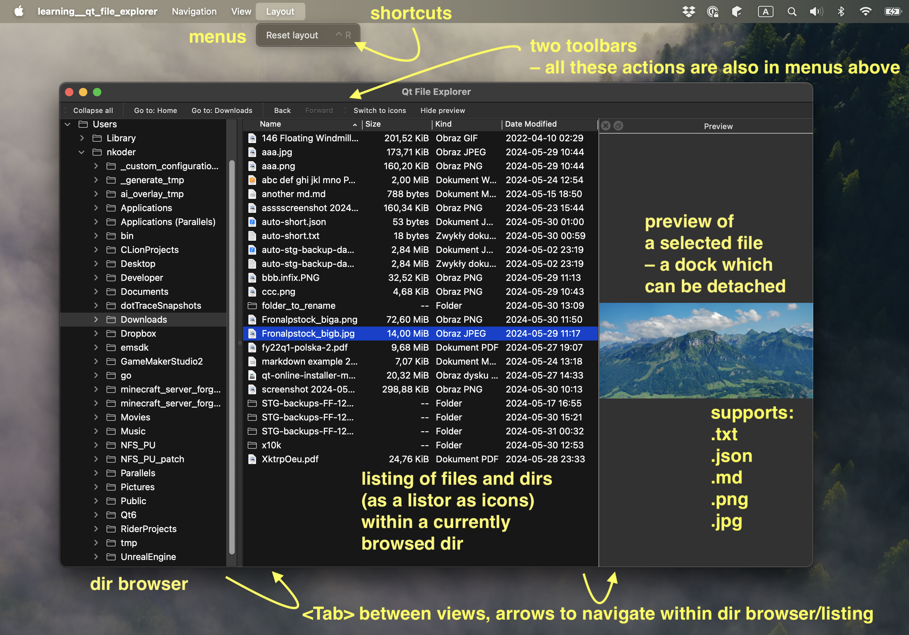

# learning--qt-file-explorer

It is a small project in which I learn C++ and Qt by creating a simple file explorer.

It covers topics like widgets and models, signals and slots, smart pointers, and a bit of concurrency (in `image_preview_widget.cc`).

## Development setup

### macOS

- I was developing this project on macOS Sonoma 14.4.1, on a MacBook with Apple M1 Max CPU.
- I installed Qt6 with an [official installer of the open source version](https://www.qt.io/download-open-source)
    - during an installation process I picked `Qt` > `Qt 6.7.1` > `Desktop` and deselected everything else
    - in my case valid `CMAKE_PREFIX_PATH` (used below) was: `/Users/<username>/Qt6/6.7.1/macos/lib/cmake"`
- I was developing it in CLion 2024.1.1.
    - I had to add `-DCMAKE_PREFIX_PATH="<path_to_my_qt_cmake>"` in "CMake options" section of my CLion CMake settings
- I had CMake 3.29.3 installed with `brew install cmake`.

The set of commands to build and run this project in Debug mode (on macOS):

```sh
./cleanup.sh
CMAKE_PREFIX_PATH="<path_to_your_qt_cmake>" ./run_debug.sh
```

For Release mode please use `./run_release.sh`.

### Windows

I do not have any Windows machine right know which I could use for setting up Qt development env.

To build this project on Windows, please take a look at macOS section above and try to replicate those steps since the steps should be similar (e.g. to have Qt 6 installed, to have `cmake` available, etc.)

## Usage



### Shortcuts

| action               | macOS  | Windows   |
|----------------------|--------|-----------|
| Go to: Home          | Ctrl+H | Win+H     |
| Go to: Downloads     | Ctrl+D | Win+D     |
| Back                 | Cmd+[  | Alt+Left  |
| Forward              | Cmd+]  | Alt+Right |
| Switch to icons/list | Ctrl+V | Win+V     |
| Show/hide preview    | Ctrl+P | Win+P     |
| Reset layout         | Ctrl+R | Win+R     |

## File preview and performance concerns

At some point I experienced performance issues when quickly changing the currently selected file (with a constantly pressed up/down arrow).

There are basically 3 types of a preview implemented in this file explorer:

- `ImagePreviewWidget` for images in formats supported by Qt (`QImageReader::supportedImageFormats()`), based on `QLabel` and `QPixmap(pathToImage)`
- `MarkdownPreviewWidget`, `JsonPreviewWidget`, `TextPreviewWidget` – three similar preview widgets based on `QTextEdit`/`QPlainTextEdit`
- `FileNamePreviewWidget` as a fallback one, which simply prints a file's or dir's name inside a `QLabel`

First, I noticed GUI freezes when navigating over a 3 MB `.txt`/`.json` files. I was trying to put some work into threads, but apparently the performance issue was in `QLabel::setText(hugeText)` itself, which is supposed to be run on the main thread. Luckily, after some googling I learnt there is a dedicated `QPlainTextEdit` widget for such type of content. I tried it an realized the performance issues are gone. Apparently, according to what I google / read in docs, `QPlainTextEdit` loads and renders only as much text as needed for a given visible area (which is a tiny fraction of an entire file).

Second, I tackled another GUI freeze, a less impactful one, but still apparent – for a 76 MB PNG image file. After some debugging I learned that the freeze time is mostly spent on `QPixmap(pathToImage)`. I watched several YouTube videos on how to put work into threads in Qt and tried some of them. In the end I cleaned up the implementation to just a simple combination of `QFutureWatcher<QPixmap>` and setting it to observe a new `QFuture<QPixmap>` every time an image is selected to be previewed. The performance issue was gone.

For images, I also had to deal with a race condition: since my images were loading in a separate thread, it was easy to start preview of a huge image, then switch to preview of a tiny image, then the huge image replaces the tiny one, because if finished loading. I addressed it by both a) setting a new `QFuture` on the `QFutureWatcher` every time a loading is initiated and b) calling `.cancel()` on the `QFutureWatcher` to avoid unnecessary work in a background.

## Known issues

Issues I spotted, but have no time right now to fix them:

- Internal state of whether the preview is shown or not (and the toolbar's/menu's action label as well) is not synchronized with a case where the preview dock gets detached, then closed with its own top bar close button.

## Other notes

- I took a look at [official Google C++ Style Guide](https://google.github.io/styleguide/cppguide.html) and applied
  *some* of those on this codebase here.
- Code formatting was performed by CLion IDE (with some configuration modifications applied by me to match aforementioned Google's guide a bit). It might result in some strange indentation, especially for long constructor signatures.
- I was thinking about adding a language switcher between English and Polish. This is why I prepared the GUI labels with wrapping `tr(…)` calls. In the end, I decided setting up the whole Qt Linguist workflow for such simple project would be a big time expense and the reward would be non-satisfactory.

